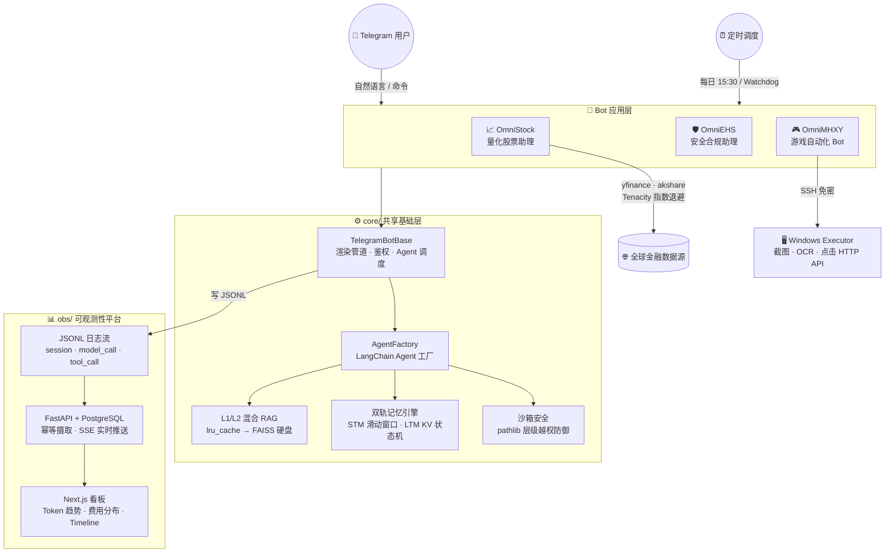

# 🤖 OmniBot | 生产级多智能体 Monorepo 平台


OmniBot 不是一个 Demo，而是一个**持续运行在生产环境中的多 Agent 平台**。

三个完全不同领域的 Telegram Bot（量化分析、安全合规、游戏自动化）共用同一套 `core/` 基础设施，并配套一个 **FastAPI + PostgreSQL + Next.js** 全栈可观测性平台，实时追踪每次 LLM 调用的 Token 消耗与费用。

本项目致力于展示：如何用**确定性的工程手段**（共享核心、混合缓存、双轨记忆、沙箱隔离、全链路可观测）将多个 AI Agent 整合为一个真正可维护、可扩展的系统。

---

## 🏗️ 系统架构 (System Architecture)



---

## 💡 核心护城河与工程突破 (Engineering Highlights)

### 1. 🧩 Monorepo 共享 Core：一套基础设施，N 个领域 Bot

- **行业痛点**：多 Bot 项目往往各自实现鉴权、渲染、Agent 调度，代码严重重复，维护成本随 Bot 数量线性膨胀。
- **架构解法**：将所有通用能力收敛进 `core/TelegramBotBase`。领域 Bot 仅需通过钩子方法注入差异逻辑，新增一个 Bot 只需实现业务钩子，零基础设施成本：
  ```python
  class StockBot(TelegramBotBase):
      def get_bot_name(self) -> str: return "OmniStock"
      def setup_job_queue(self, app): ...      # 价格预警轮询
      def handle_custom_cmd(self, cmd, ...): ... # /portfolio /report
  ```

### 2. 🧮 业务解耦：彻底根除大模型数值计算幻觉

- **行业痛点**：LLM 在多币种汇率折算、精确持仓盈亏核算时极易产生致命数值错误。
- **架构解法**：剥夺大模型的计算权，设计独立的 `valuation_engine.py` 纯 Python 引擎接管所有财务核算。同时引入 Ticker 格式化中间件，用户输入 `"0700"` 自动补齐 `.HK`，消除 LLM 市场代码识别误差。LLM 只负责意图理解，核心数字由 CPU ALU 保障精确。

### 3. 🚀 L1/L2 混合 RAG 缓存：毫秒级命中，零 API 冗余调用

- **行业痛点**：每次重启都需重建向量索引，Embedding API 调用成本高、延迟不可控。
- **架构解法**：设计三级穿透缓存：**L1 进程内 `lru_cache`**（毫秒级）→ **L2 FAISS 硬盘持久化**（跨重启共享）→ **MTime 穿透校验**（文件未变更则永不重建）。每日盘后报告自动归档进知识库，RAG 数据随时间持续累积，形成数据飞轮。

### 4. 🧠 双轨记忆引擎：短期上下文 + 长期用户状态并行治理

- **行业痛点**：长对话极易导致上下文爆炸，用户偏好无法跨会话持久化。
- **架构解法**：
  - **STM**：`FileChatMessageHistory` 滑动窗口（10 条），跨重启持久化，自动裁剪防 Token 溢出。
  - **LTM**：`user_profile.json` KV 状态机，`filelock` 文件互斥锁保障定时调度与用户异步交互并发写入的原子安全。

### 5. 🔒 沙箱安全防御：代码层强制路径越权拦截

- **行业痛点**：赋予 Agent 本地 I/O 权限后，恶意 Prompt 注入极易引发目录穿越攻击（Path Traversal）。
- **架构解法**：弃用脆弱的字符串 `startswith` 拦截，强制采用 Python 3.9+ `pathlib.is_relative_to()` 进行绝对层级校验，Agent 所有读写行为被死锁在 `agent_workspace/` 沙箱内，无论 Prompt 如何构造均无法逃逸。

### 6. 📊 全链路可观测性：从 JSONL 到实时看板

- **行业痛点**：多 Agent 系统黑盒运行，LLM 调用成本、工具执行链路完全不可见。
- **架构解法**：`core/observability.py` 在每次 `execute_agent_task` 中通过 LangChain Callback 自动捕获完整调用链（`session → message → thought → model_call → tool_call → tool_result`），写入 JSONL。`obs/` 平台幂等摄取入 PostgreSQL，Next.js 看板实时展示 Token 趋势与费用分布，SSE 推送零延迟刷新。

---

## 🤖 三个 Agent 详览

### 📈 OmniStock — 量化股票助理

覆盖 A 股 / 港股 / 美股，每日 15:30 自动执行盘后研报，支持持仓管理、价格预警、K 线分析。

| 能力 | 实现 |
|------|------|
| 多市场查价 | yfinance + akshare 双源，Tenacity 指数退避 |
| K 线图生成 | mplfinance 渲染，Playwright 高清 PNG 发送 |
| 持仓估值 | 多币种实时折算 CNY，纯 Python 引擎保障精度 |
| 价格预警 | 5 分钟轮询，跌破/突破触发即时推送 |
| 盘后研报 | 多源资讯聚合去重 → LLM 生成 → 邮件 + Telegram 双渠道 |
| 研报独立子进程 | `subprocess.Popen` 投递，主线程不阻塞 |

### 🛡️ OmniEHS — 安全合规助理

EHS（环境健康安全）领域专业 Agent，法规查询、化学品 GHS 数据、隐患全生命周期管理。

| 能力 | 实现 |
|------|------|
| 法规检索 | 联网搜索 GB/ISO 标准解读 |
| GHS 查询 | 化学品名称 / CAS 号 → 危害分类及 SDS |
| 隐患日志 | 6 级严重度追记，按日期/等级/关键词查询 |
| 作业许可 | 动火/高处/有限空间/临时用电/吊装标准检查清单 |

### 🎮 OmniMHXY — 游戏自动化 Bot

通过 SSH 控制 Windows 端 Executor，结合 OCR + VL 大模型，实现梦幻西游日常任务无人值守。

| 能力 | 实现 |
|------|------|
| 远程执行 | SSH 免密连接 Windows，HTTP API 控制点击/截图 |
| 视觉感知 | Qwen3-VL 多模态模型识别游戏界面 |
| 状态机 Runner | 确定性主流程 + VL 兜底，可重试、可观测 |
| Watchdog | 独立容器健康监测，失败自动重启 Executor |

---

## 🛠️ 技术栈 (Tech Stack)

| 类别 | 技术 |
|------|------|
| Agent 编排 | LangChain · LangChain Callbacks · AgentExecutor |
| LLM | MiniMax-M2.7 · Qwen3-VL（DashScope，OpenAI 兼容协议） |
| Telegram | python-telegram-bot 22.x |
| 渲染 | Playwright（Markdown 表格 → 高清 PNG，3x DSF） |
| 金融数据 | yfinance · akshare · mplfinance |
| 向量检索 | FAISS · DashScope Embeddings |
| 可观测性后端 | FastAPI · SQLAlchemy async · PostgreSQL · Alembic |
| 可观测性前端 | Next.js 14 · TypeScript |
| 容错 | Tenacity 指数退避 · filelock 原子写 |
| 部署 | Docker · Docker Compose |

---

## 📂 目录结构 (Directory Topology)

```text
omnibot/
├── core/                    # ⚙️ 共享基础层（所有 Bot 公用）
│   ├── tg_base.py           # TelegramBotBase：渲染、鉴权、Agent 调度
│   ├── agent_base.py        # build_agent()：LangChain Agent 工厂
│   ├── observability.py     # JSONL 日志器 + LangChain Callback Handler
│   └── tools/               # 沙箱 I/O · 记忆引擎 · 任务投递
│
├── stock_bot/               # 📈 OmniStock 量化助理
├── ehs_bot/                 # 🛡️ OmniEHS 安全合规助理
├── mhxy_bot/                # 🎮 OmniMHXY 游戏自动化
│
├── obs/                     # 📊 可观测性平台（独立 Docker Compose）
│   ├── api/                 # FastAPI + PostgreSQL 摄取服务
│   └── web/                 # Next.js 统计看板（端口 3100）
│
├── data/{bot}/              # 🔒 各 Bot 持久化数据（完全隔离）
│   ├── memory/              # LTM 状态 + STM 历史
│   ├── knowledge_base/      # RAG 原始文件 + 归档日报
│   ├── embeddings/          # FAISS 向量库 L2 缓存
│   └── agent_workspace/     # Agent 沙箱（报告、图表）
│
└── jobs/{status,logs}/      # 研报子进程任务状态与日志
```

---

## 🚀 快速启动 (Quick Start)

```bash
# 1. 配置环境变量
cp .env.example .env    # 填入 API Key 与 Bot Token

# 2. 构建基础镜像（含 pip 依赖 + Playwright，首次耗时较长）
docker build -f Dockerfile.base -t omnibot-base:latest .

# 3. 启动所有 Bot 服务
docker compose up -d

# 4. 启动可观测性平台（独立 Compose）
docker compose -f obs/docker-compose.yml up -d

# 查看日志
docker compose logs -f
docker compose -f obs/docker-compose.yml logs api -f
```

| 容器 | 说明 |
|------|------|
| `v2-omnistock-tg-bot` | OmniStock Telegram Bot |
| `v2-omnistock-daily-job` | 盘后调度器（每日 15:30） |
| `v2-omniehs-tg-bot` | OmniEHS Telegram Bot |
| `v2-omnimhxy-tg-bot` | OmniMHXY 游戏控制 Bot |
| `obs-api-1 / obs-web-1 / obs-db-1` | 可观测性平台 |

---

## 🌟 设计哲学 (Design Philosophy)

> **"A multi-agent system is only as reliable as its shared infrastructure."**
>
> *多智能体系统的可靠性上限，由其共享基础设施的工程质量决定。*
